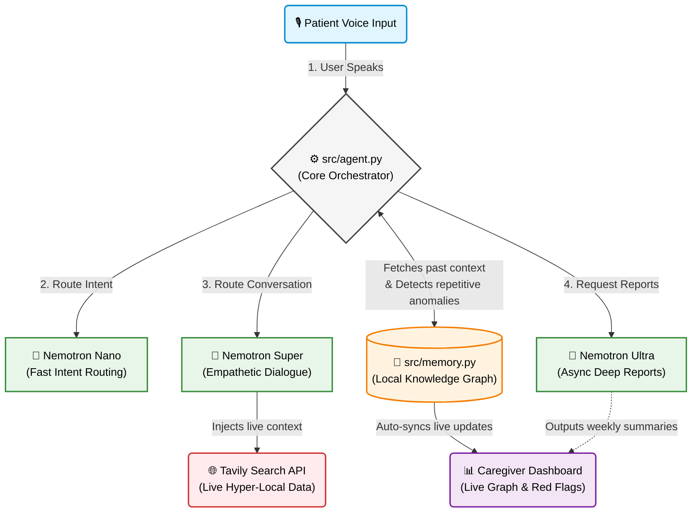

# Memora Architecture Diagram

This diagram provides a high-level overview of Memora's data flow, illustrating how a patient's voice input is orchestrated through the custom agent loop, dynamically routed to appropriate Nemotron models, anchored with real-world data via Tavily, and finally persisted in the local Memory Graph for caregiver visualization.

### Key Highlights
1. **Dynamic Routing:** `agent.py` acts as a strict deterministic router, ensuring the fast, cheap `Nano` model is used for intents, while `Super` handles the core chat.
2. **Grounding:** Before the LLM answers, context is retrieved simultaneously from the local `Memory Graph` (past habits) and `Tavily` (live world data like open pharmacies).
3. **Safety & Monitoring:** Anomalies (e.g., asking the same question 3 times) are detected mathematically during the graph interaction, triggering a Red Flag node directly on the `Caregiver Dashboard`.
